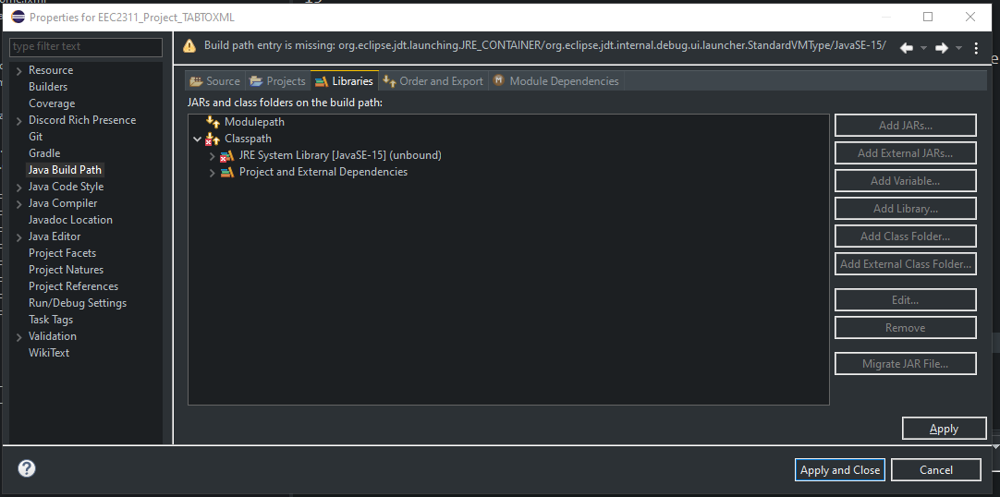

# Music Tab to Music XML

## Setup Instuctions
  ### Setting up using eclipse
   1.  Import project via git - using this link (https://github.com/Deys2000/actual-EECS2311Group15).
   2.  Once imported, click on the project and navigate to **buidPath**. 
   3.  Under **Classpath**, select the JRE Sytem Library\[version](unbound) and click on edit, to the right, and select the latest JRE. 
   4.  Navigate to the nav bar, on the top, select ***Run/Run Configurations.*** On drop down to the left select ***java Application.*** You should see ***Main*** under that list.   Select it and navigate to the ***Arguments*** tab. 
   Under ***VM arguments*** , add the following line `--module-path "javafx-sdk-15.0.1/lib" --add-modules javafx.controls,javafx.fxml` 
   5.  Now the project should be all setup. Navigate to Main and run the program. :)
 
