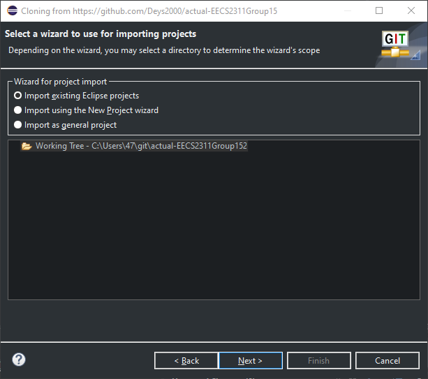
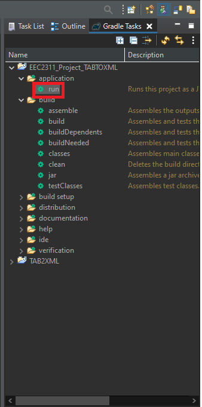
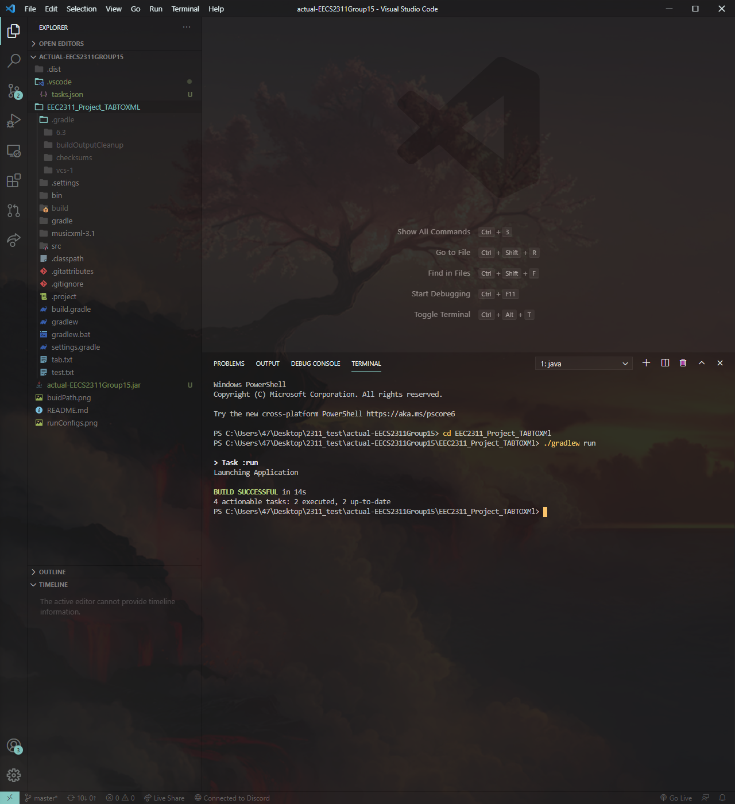

## 1. Introduction 

## **1.1 System Overview**

DA CAPO is a program that provides the user the ability to translate a guitar, bass or drum tablature into MusicXML, which is then saved as a file at a location of the user&#39;s choosing.

DA CAPO is the perfect software for any amateur musician looking to see what their tablatures look like on a staff, or for a music teacher looking to translate multiple tablatures to music notation, then editing them afterwards.

At the moment, Da Capo can only translate a basic formatted guitar tablature, with frets from 0-9 and no special symbols. The translation also has a number of errors. However, it will be able to translate more complex guitar tablature, as well as bass and drum tablatures, in the future.

##
## **1.2 Relevant Documents**
- User Manuel ([Doc](https://docs.google.com/document/d/1IhHdD-Nd9ZIJpAWSL3IuWYTfuE3LoL_WjTELXTAvqtw/edit?usp=sharing), [Pdf](Da Capo User Manual.pdf))
- Requirements ([Doc](https://docs.google.com/document/d/1e6TOLw2BATm9XsG7jF8Gk9tFdCKltIL-go9Af51f5Sw/edit?usp=sharing), [Pdf](Requirements Document.pdf))
- Testing ([Doc](https://docs.google.com/document/d/1OiztrqSeb4tApYALv-m1DQjSQHc3qtqlymFJoWkLy1M/edit?usp=sharing), [Pdf](Testing Document.pdf))
- Reference/Conducted Research ([Doc](https://docs.google.com/document/d/1jesq2F7oVmy8Y_HqsO5No0yU1nKyRxtxBuIApClda5I/edit#heading=h.5uh2qfisicct), [Pdf](Research Document.pdf))
 
## 2. Installation Instructions 

## **2.1 Setting Up Using Eclipse**

1. Import project via git - using this link ([https://github.com/Deys2000/actual-EECS2311Group15](https://github.com/Deys2000/actual-EECS2311Group15)).

1. Make sure to select _ **Import existing Eclipse projects** _ while importing. 
2. Once imported, navigate to the Window tab at the top, then Show View, and click on Other...

   

1. A new window called Show View will pop up. Scroll down to the Gradle folder, open it, select Gradle Tasks, then click Open.

   

1. A new view called Gradle Tasks should be visible in the main screen of Eclipse. In that view, navigate to the project, open the application folder, then double click &quot;run&quot; to run the program!

   

## **2.2 Setting Up Using Visual Studio Code**

1. Import project via git - using this link ([https://github.com/Deys2000/actual-EECS2311Group15](https://github.com/Deys2000/actual-EECS2311Group15)).

2. Open the directory in **VSC** and navigate to the terminal.

    
3. Next you want to change your working **PWD** using this command ``**cd EEC2311\_Project\_TABTOXMl**``

4. Now, to actually build and run the project. Execute the following command in the same terminal ``_ **./gradlew run** _``
