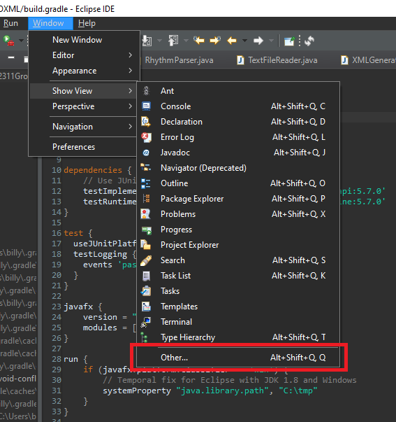
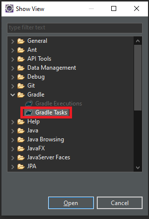
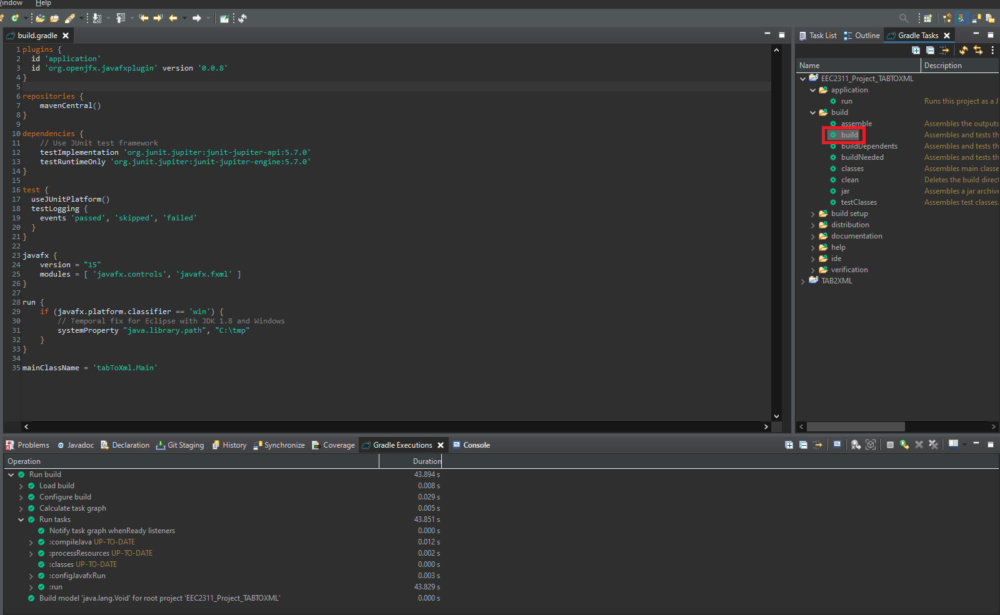
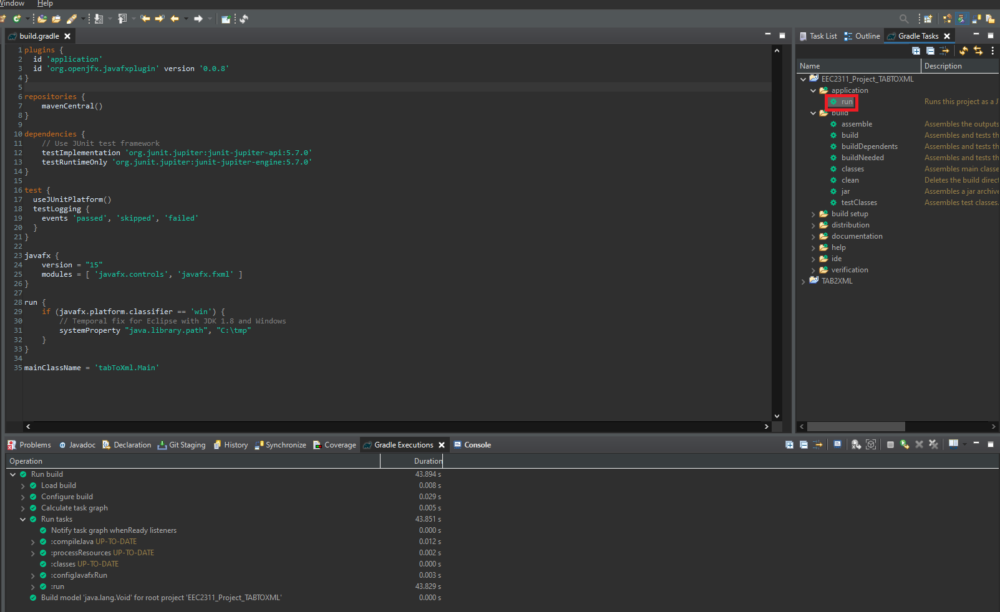

# Music Tab to Music XML

## Setup Instuctions
 > ### Setting up using eclipse
 > 1.  Import project via git - using this link (https://github.com/Deys2000/actual-EECS2311Group15).
 > 2.  Once imported, navigate to the Window tab at the top, then Show View, and click on Other... 
 > 3.  A new window called Show View will pop up. Scroll down to the Gradle folder, open it, select Gradle Tasks, then click Open. 
 > 4.  A new view called Gradle Tasks should be visible in the main screen of Eclipse. In that view, navigate to the project, open the build folder and double click "build". Gradle will now prepare the project to be run. A new view called Gradle Executions should pop up and you can view the progress there. 
 > 5.  Once the project is all built, navigate back to the Gradle Tasks view, open up the application folder, and then double click "run" to run the program! 
 
